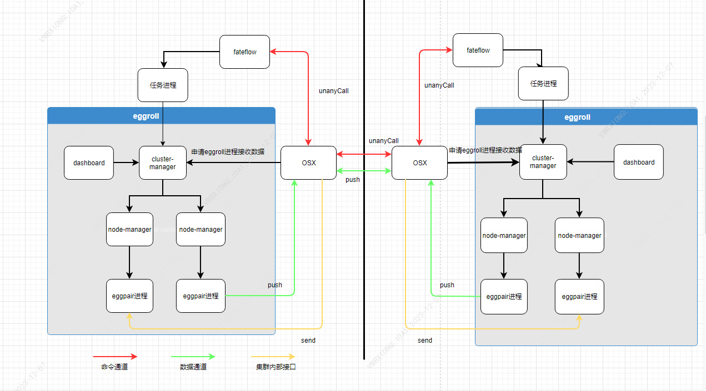

# Eggroll部署文档说明

## 1    环境初始化

### 1.1  环境要求

| **操作系统** | CentOS 7.2                                                   |
| :----------- | :----------------------------------------------------------- |
| **工具依赖** | 安装yum源工具：gcc gcc-c++ make autoconfig   openssl-devel supervisor gmp-devel mpfr-devel libmpc-devel libaio numactl   autoconf automake libtool libffi-dev snappy snappy-devel zlib zlib-devel   bzip2 bzip2-devel lz4-devel libasan |
| **操作用户** | 用户名: app 组:apps                                          |
| **系统配置** | 1. 挂载300G可用磁盘空间到/data目录    2. 创建/data/projects目录，属主app用户 |

### 1.2  安装软件包

集群所有节点都需要安装：jdk1.8、virtualenv独立运行环境（可进入python3.6版本）

数据库节点：mysql8.0

## 2    项目拉取及打包

从github拉取Eggroll项目，通过执行auto-packaging.sh自动打包脚本在同目录下生成eggroll.tar.gz

```shell
git clone -b v3.0.0 https://github.com/FederatedAI/eggroll.git
cd eggroll/deploy
windows : auto-packaging.bat
linux : sh auto-packaging.sh
```

## 3    部署
###3.1 部署架构


### 3.2  解压文件

将eggroll.tar.gz移到或发送到eggroll的安装目录下，然后执行：

```shell
tar -xzf eggroll.tar.gz
```

将eggroll.tar.gz解压后，其目录结构如下：

```properties
|--bin			--存放eggroll自带启动脚本
|--conf			--存放eggroll配置文件(包含部署需要修改文件)
|--data			--存放数据库初始化及缓存文件
|--deploy		--存放部署相关文件
|--lib			--存放eggroll所有jar包
|--python		--存放eggroll python代码部分
```

数据库建表语句
```properties
|--conf
 |--create-eggroll-meta-tables.sql
```

### 3.3  修改配置文件

各配置文件修改说明如下：

- **修改eggroll.properties配置文件**

```shell
vi conf/eggroll.properties
```

```properties
<--数据库配置选项说明：
	eggroll数据库连接方式：
	1、安装的mysql8.0数据库，建议集群版多节点使用，若使用此方式则需要按如下方式进行修改配置。-->

eggroll.resourcemanager.clustermanager.jdbc.driver.class.name=com.mysql.cj.jdbc.Driver
eggroll.resourcemanager.clustermanager.jdbc.url=jdbc:mysql://数据库服务器ip:端口/数据库名称?useSSL=false&serverTimezone=UTC&characterEncoding=utf8&allowPublicKeyRetrieval=true
eggroll.resourcemanager.clustermanager.jdbc.username=数据库用户名
eggroll.resourcemanager.clustermanager.jdbc.password=数据库密码

<--eggroll相关配置参数说明：
	1、以下包含的路径都是相对Eggroll的实际部署目录之下的相对路径，若不在Eggroll的实际部署目录之下，可用系统绝对路径；
	2、根据部署方法分为三个修改级别：需要修改、建议默认、默认即可，其中端口为建议默认但需要根据实际服务器端口是否可用或部署方式来考虑是否修改，以避免端口冲突。-->
eggroll.resourcemanager.clustermanager.host=127.0.0.1	<--clustermanager服务ip地址，需要修改-->
eggroll.resourcemanager.clustermanager.port=4670	<--clustermanager服务端口，建议默认-->
eggroll.resourcemanager.nodemanager.host=127.0.0.1	<--nodemanager服务ip地址，需要修改-->
eggroll.resourcemanager.nodemanager.port=4671	<--nodemanager服务端口：1、部署单机版与clustermanager相同，建议默认；2、部署集群版需修改为其他可用端口，需要修改-->

# dashboard
eggroll.dashboard.server.port=8083     <--dashboard服务端口,选择没有占用的端口即可-->
eggroll.security.session.expired.time=30    <--session会话（登录）过期时间,单位分钟-->
eggroll.security.login.username=admin   <--配置的登录用户名-->
eggroll.security.login.password=admin   <--配置的登录密码-->
eggroll.security.encrypt.public_key=   <--登录密码加密公钥-->
eggroll.security.encrypt.private_key=   <--登录密码加密私钥-->
eggroll.security.encrypt.enable=false   <--是否开启加密，true开启，false关闭-->

<--以下几项默认即可-->
eggroll.data.dir=data/			<--存放缓存数据目录，默认即可-->
eggroll.logs.dir=logs/			<--存放eggroll生成日志目录，默认即可-->
eggroll.resourcemanager.process.tag=	<--集群服务标签，对不同集群需要单独指，例如EGGROLL_TAG，需要修改-->
eggroll.bootstrap.root.script=bin/eggroll_boot.sh	<--eggroll_boot.sh启动脚本路径，默认即可-->
eggroll.resourcemanager.bootstrap.egg_pair.exepath=bin/roll_pair/egg_pair_bootstrap.sh		<--egg_pair启动脚本路径，默认即可-->
eggroll.resourcemanager.bootstrap.egg_pair.venv=		<--virtualenv安装路径，需要修改-->
eggroll.resourcemanager.bootstrap.egg_pair.pythonpath=python		<--python文件路径，也作PYTHONPATH，默认即可-->
eggroll.resourcemanager.bootstrap.egg_pair.filepath=python/eggroll/roll_pair/egg_pair.py	<--egg_pair.py文件路径，默认即可-->
eggroll.resourcemanager.bootstrap.egg_pair.ld_library_path=		<--egg_pair ld_library_path路径，默认即可-->

eggroll.session.processors.per.node=4		<--单节点启动egg pair个数，小于或等于cpu核数，建议16-->
eggroll.session.start.timeout.ms=180000		<--session超时设定ms数，默认即可-->
eggroll.rollpair.transferpair.sendbuf.size=4150000		<--rollpair传输块大小，默认即可-->
<--以上几项默认即可-->


```

### 3.4  nodemanager多节点部署
```properties
<-- 数据库配置要跟集群内clustermanager一致>
eggroll.resourcemanager.clustermanager.jdbc.driver.class.name=com.mysql.cj.jdbc.Driver
eggroll.resourcemanager.clustermanager.jdbc.url=jdbc:mysql://数据库服务器ip:端口/数据库名称?useSSL=false&serverTimezone=UTC&characterEncoding=utf8&allowPublicKeyRetrieval=true
eggroll.resourcemanager.clustermanager.jdbc.username=数据库用户名
eggroll.resourcemanager.clustermanager.jdbc.password=数据库密码

<--ip port 配置>
eggroll.resourcemanager.clustermanager.host=127.0.0.1	<--集群内clustermanager服务ip地址-->
eggroll.resourcemanager.clustermanager.port=4670	<--集群内clustermanager服务端口-->
eggroll.resourcemanager.nodemanager.host=127.0.0.1	<--nodemanager服务ip地址-->
eggroll.resourcemanager.nodemanager.port=4671	<--nodemanager服务端口-->

```

## 4   服务启动

Eggroll的bin目录中附带启动脚本bin/eggroll.sh使用说明：

```shell
source ${EGGROLL_HOME}/init_env.sh       --${EGGROLL_HOME} means the absolute path of eggroll
sh bin/eggroll.sh $1 $2		
<--
	$1:需要执行操作的服务名称,例如clustermanager,nodemanage,dashboard,all(表示所有服务组件);
	$2:需要执行的操作, start( 启动 ), status(查看状态), stop(关闭), restart(重启), usage(查看使用方法说明)
-->
<--
    注意事项:
    stop在停止服务的时候会执行默认100次正常终止服务的操作, 如果在100次后仍无法正常终止进程, 会强制终止进程.
    restart后面可以跟时间参数, 表示先停止服务后再启动服务前等待时间, 默认为5秒.
    例如: sh bin/eggroll.sh dashboard restart 10
-->

```

使用例子：

```shell
source ${EGGROLL_HOME}/init_env.sh       --${EGGROLL_HOME} means the absolute path of eggroll

<--使用usage 查看使用方法服务-->
sh bin/eggroll.sh usage

<--启动所有服务-->
sh bin/eggroll.sh all start

<--查看clustermanager服务状态-->
sh bin/eggroll.sh clustermanager status

<--重启dashboard服务-->
sh bin/eggroll.sh dashboard restart [time]

<--关闭nodemanager服务-->
sh bin/eggroll.sh nodemanager stop


将各节点对应的服务启动成功后, 部署完成

```

###常见问题


