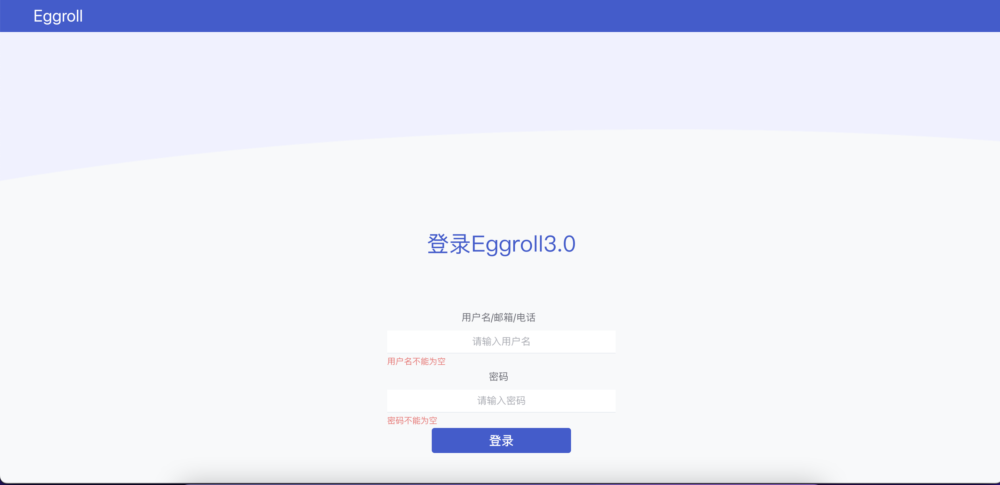
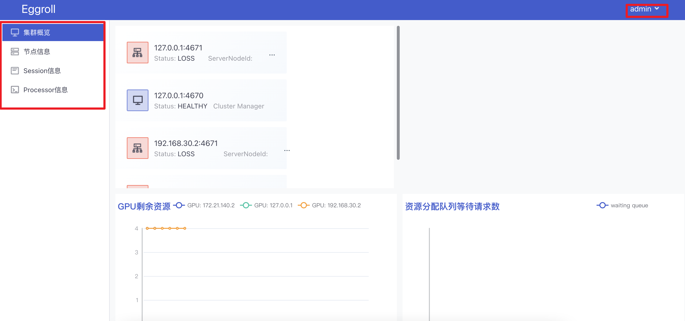
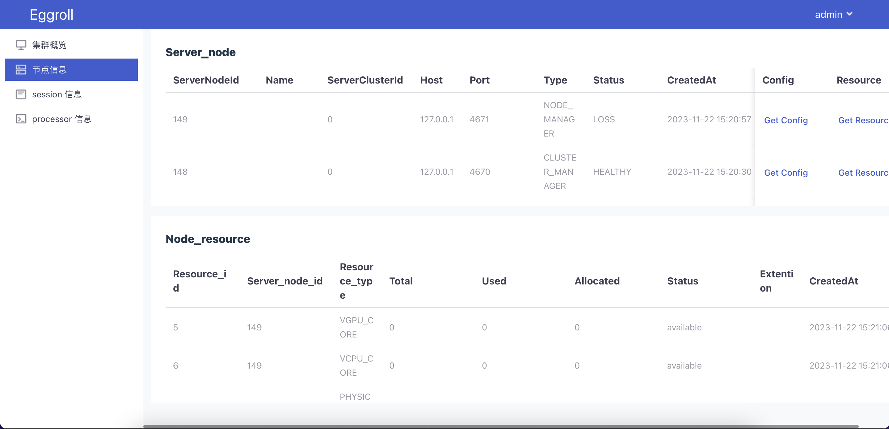
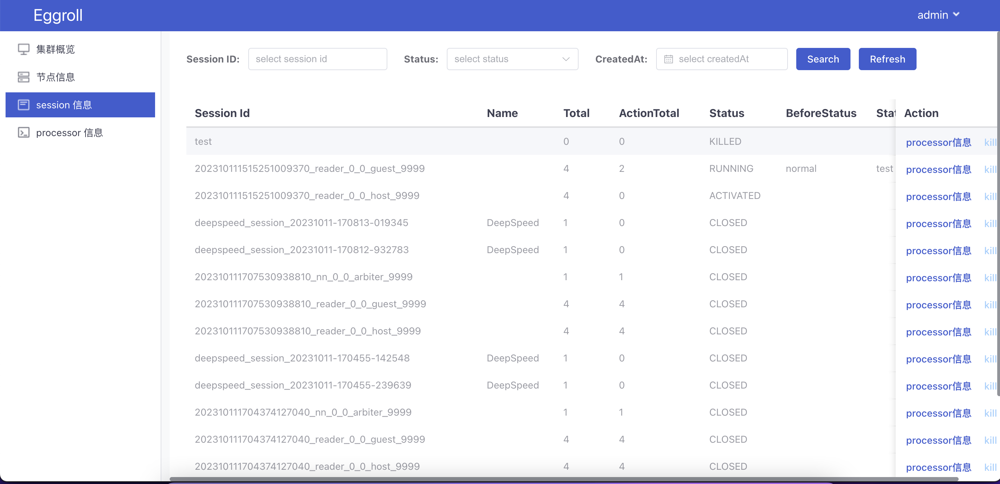
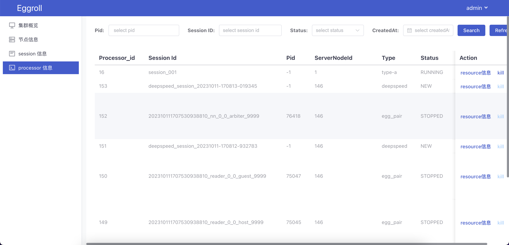

# Eggroll_Dashboard使用文档

## 1.登录页面

需要先登录才能使用，账号和密码目前可以在配置文件里面配置。

## 2.首页介绍

菜单栏：

左侧是菜单栏。目前只有4个菜单，分别是：集群概览、节点信息、Session信息、Processer信息。

然后右侧就是集群当前的一些状态：第一个面板是集群的节点，分为Clustermanager和Nodemanager两种节点，其中只有Nodemanager点击可以查看当前节点的资源信息(CPU、GPU和PHYSICAL_MEMORY)，并且有每一种资源的总数和使用情况。

后面4种折线图是用来查看当前服务器的各种情况的折线图，这是实时的折线图，例如GPU剩余资源，如果有使用，会有折线的波动，横坐标开始时间是从用户登录的时间，然后实时显示每种活动/资源的信息。

## 3.节点信息页面

这个页面分为上下两层，上面部分是节点信息，用来展示每个节点的信息，有两个操作按钮，分别是：Get Config、 Get Resource。

Get Config：是获取当前节点在系统/服务器中的配置信息。

Get Resource：获取当前节点资源(CPU、GPU和PHYSICAL_MEMORY)

下面的是节点资源信息，用于展示所有节点的资源信息

## 4.Session信息页面

session信息页面用来查询所有session的页面，有三个搜索框分别是：Session ID、Status和CreatedAt，对应下面列表的其中三个字段，可用于模糊查询。此列表后方有2个按钮是：Processor信息和kill。

Processor信息：可以展示当前session下的所有子进程信息。

kill：可以kill当前的session任务

## 5.Processer信息页面

Processer信息页面是用来展示和查询所有子进程信息的页面。其中有5个字段可以用来筛选列表。列表后方有2个按钮，分别是：Resource信息和kill

Resource信息：是获取当前子进程的所有资源信息。

kill：kill掉当前子进程(系统会自动判定session任务下任何一个子进程被kill掉，会把所属session定时kill掉，此功能是定时任务)